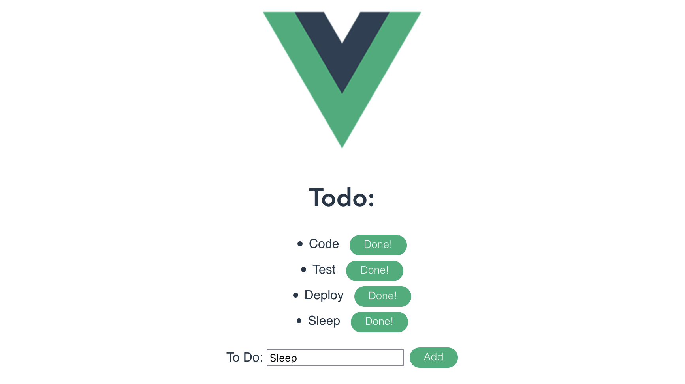

# vue-todo

This is a basic ToDo app written as a SPA using Vue3. Todo items are kept in the data class and do
not persist across reloads (no back end.)

Todos can be added and removed.



## Project setup
```
npm install
```

### Compiles and hot-reloads for development
```
npm run serve
```

### Compiles and minifies for production
```
npm run build
```

### Lints and fixes files
```
npm run lint
```

### Customize configuration
See [Configuration Reference](https://cli.vuejs.org/config/).
